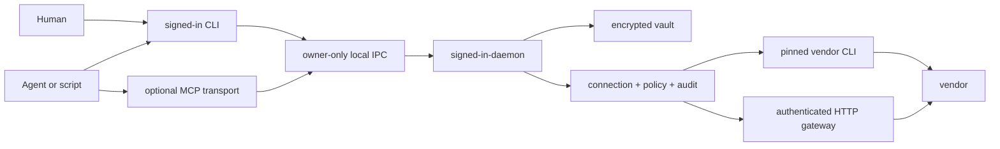

# signed-in

Named, policy-aware vendor access for humans and coding agents—without handing the calling process a
reusable credential.

```sh
signed-in login
signed-in status
signed-in ping
signed-in aws s3 ls
signed-in github pr list
signed-in request polar GET /v1/products
```

`signed-in` is a machine-wide authorization gateway. You sign in once, give each connection a useful
name, and use the same interface from Codex, Claude Code, scripts, or an ordinary terminal. The
credential stays inside a user-scoped daemon while commands pass through connection selection,
policy, redaction, and audit.

> [!IMPORTANT]
> signed-in is pre-release software. Its cooperative guardrails are useful today, but it is not a
> hostile-code sandbox for processes running as the same operating-system user. Read the
> [security model](./docs/security-model.md) before relying on it.

## Why signed-in?

I got tired of managing multiple vendor accounts across multiple projects and multiple agent
applications. Codex, Claude Code, provider CLIs, browser sessions, and project tools all accumulated
their own connection state, often tied to whichever account happened to be active at the time. Once
you have work and personal accounts—or development and production authority—that becomes chaos.
Multiply that across five machines and it becomes complete chaos.

I wanted named, purposeful connection management:

```text
github@personal
github@work
clerk@acme-production
aws@acme-staging
```

The first connection can remain the service default. Additional connections are explicit, inspectable,
and reusable across projects. Optional project bindings can select an exact connection and narrow what
it may do without copying credentials into the repository.

## Why not MCP?

MCP is useful when it adds a genuinely valuable capability. Context7-style documentation access is a
good example: the model gets current, relevant documentation without having to discover it itself.

But vendor management APIs are already documented, discoverable interfaces. Frontier agentic models
are generally very good at reading those docs, forming a request, interpreting the result, and trying
the next endpoint. Wrapping every API operation in another manually maintained MCP tool often creates
a stale second interface with more schemas, more context, more version drift, and less surface area
than the API it hides.

signed-in takes a different position:

- authentication and policy belong in one durable local gateway;
- API and CLI semantics should remain the vendor's own;
- agents should receive authenticated *use*, not reusable credentials;
- documentation can be fetched when needed instead of being fossilized into wrappers;
- one relative HTTP request surface can reach documented endpoints that no bundled integration has
  modeled yet.

This is not anti-MCP. `signed-in mcp` exposes the same daemon boundary for clients that require MCP.
MCP is a transport here, not the owner of authentication and not a hand-written mirror of every
vendor API.

## How it works



The frontend never has a secret-getter method. Explicit human login can forward hidden input one way
to the daemon, but routine agent and CLI processes receive only the result of an allowed operation.
The vault survives daemon and machine restarts; its wrapping key lives in macOS Keychain, Windows
Credential Manager, or Linux Secret Service.

See [Architecture](./docs/architecture.md) for the complete model.

## Installation

### From source

Requirements:

- Node.js 22 or newer;
- pnpm 10;
- a working OS credential store.

```sh
git clone https://github.com/danielrob/signed-in.git
cd signed-in
pnpm install --frozen-lockfile
pnpm check
pnpm dev:install
```

The development installer builds and packs the same artifact intended for npm, installs it globally,
and verifies both binaries. After the first public release, installation will be:

```sh
npm install --global signed-in
```

## Start here

```sh
signed-in login
```

The guided flow presents one service checklist and handles each selected service in turn. It can use
browser/device sign-in, adopt a working provider CLI login, install a missing CLI, or accept a hidden
API key where that is the provider's appropriate interface. New connections receive a derived or
human-chosen alias; `<project>-<environment>` is recommended when identity alone is not meaningful.

Then prove the stored authority with a harmless authenticated request:

```sh
signed-in ping github
signed-in ping --json
```

Use an explicit alias when a service has more than one connection:

```sh
signed-in github@work pr list
signed-in request clerk@acme-production GET '/v1/users?limit=20'
```

## Give an agent access

Install the packaged operating guide into Codex, Claude Code, Cursor, GitHub Copilot, Gemini CLI, or
OpenCode:

```sh
signed-in skill install
```

For unattended setup, make the destination explicit:

```sh
signed-in skill install --global --agent codex --agent claude
signed-in skill install --local --agent all
```

Agents are instructed to discover connections, use the gateway, respect human-required and denied
outcomes, and never search for the underlying credential.

## Optional project bindings

Projects are progressive, not required up front. Add a `signed-in.config.json` only when a repository
needs an exact connection combination or narrower policy:

```sh
signed-in project trust --config ./signed-in.config.json --root "$PWD"
```

Trust resolves explicit aliases to immutable connection IDs, pins provider binaries, and seals the
reviewed snapshot. If a named connection is missing on this machine, the same flow walks you through
signing in and then seals it. Projects can also assert a provider identity, bind a provider-owned
target such as a Convex deployment, and declare safe read checks for the capabilities agents actually
need:

```json
{
  "schemaVersion": 2,
  "project": { "id": "acme-console", "name": "Acme Console" },
  "services": {
    "aws": {
      "alias": "acme-production",
      "expectedIdentity": "123456789012",
      "required": true
    },
    "convex": {
      "alias": "acme",
      "target": "prod:helpful-otter-123",
      "required": true
    }
  },
  "providers": {}
}
```

`signed-in ping` stays the single test command: it proves a standalone connection normally and
automatically proves the complete project contract inside a trusted project. Later repository edits
do not silently change runtime authority. See the
[generic project-policy example](./examples/project-policy/signed-in.config.json).

## Built-in services

AWS, Google Cloud, Gmail through GWS (read-only), Convex, Clerk, Netlify, Polar, Cloudflare, GitHub, Resend, OpenAI, Sentry, Better
Stack, PostHog, Shopify, Stripe, App Store Connect, Meta, and npm are included. Their authentication and
delivery modes differ; the [provider matrix](./docs/providers.md) documents the exact adapter.

## Security in one paragraph

signed-in is designed to stop a helpful but careless—or determined-to-help—agent from finding and
reusing credentials through normal shell, file, response, or provider-token commands. It denies known
credential extraction and minting, pins native executables, bounds HTTP origins and responses,
redacts outputs, confirms destructive work in a visible terminal, and records secret-free receipts.
It does not defend against hostile code with the ability to debug or replace the daemon under the same
OS user. See [Security model](./docs/security-model.md) and [Security policy](./SECURITY.md).

## Documentation

- [CLI reference](./docs/cli.md)
- [Architecture](./docs/architecture.md)
- [Security model](./docs/security-model.md)
- [Provider adapters](./docs/providers.md)
- [Machine pairing](./docs/pairing.md)
- [Release checklist](./docs/release-checklist.md)
- [Contributing](./CONTRIBUTING.md)

## Project status

The repository is preparing its first public release. The package name `signed-in` is currently
available on npm, but no package has been published from this repository yet. APIs and encrypted
storage migrations should be treated as pre-1.0.

## License

[MIT](./LICENSE) © Daniel Robinson
