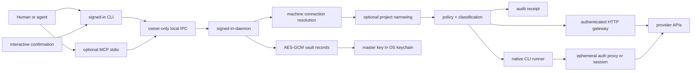

# Architecture

signed-in is a machine-wide authorization plane. CLI syntax and MCP are transports over the same
daemon-owned capability boundary; neither transport owns authentication.



## Progressive authority model

The durable unit is a machine connection, not a project or provider account:

```text
service
  ├── default → connection ID
  └── connections
      ├── immutable ID
      ├── human alias
      └── provider identity

project (optional)
  ├── service → alias → sealed connection ID
  ├── expected provider identity
  ├── provider-owned target
  ├── read capability checks
  └── narrowing policy
```

The built-in, versioned service catalog provides login instructions, credential prompts, CLI
adapters, authenticated origins, and baseline policy. `signed-in login` can therefore work on a
pristine machine without trusting repository content.

Every connection receives an immutable local ID. Its alias is derived from provider identity when
possible: personal email domains such as Gmail become `personal`, while custom domains such as
`acme.com` and `studio.co.nz` become `acme` and `studio`. Provider usernames and numeric account
identifiers become readable fallback aliases. Services that cannot expose a safe identity ask the
operator what the connection is for during login.

`default` is a pointer, never a stored alias or credential key. A service-level default resolves
ordinary commands; an explicit `service@alias` always wins. A trusted project's explicit alias is
resolved to an immutable connection ID when trusted, so renaming the alias cannot move or break its
sealed authority. Removing that connection makes the project fail closed even if a new connection
later reuses the same alias; re-trusting is the deliberate rebind. Bindings declared as `true`
continue following the machine default.

Projects never own or duplicate credentials. They select existing machine connections and add policy
that can narrow the built-in authority. A connection answers “which authenticated authority?” while a
target answers “which resource inside that authority?”; this keeps one Convex account login reusable
across deployments without confusing it with genuinely distinct Clerk or AWS credentials. Trusting a
project validates its source config, resolves and hashes relevant provider executables, then seals the
snapshot in the vault. Missing explicit connections remain pending until the human signs in and the
project is re-sealed. Runtime commands do not trust later repository edits.

## Components

### `signed-in`

The frontend resolves an optional trusted project, gathers hidden human input, presents
confirmations, streams already-redacted provider output, and renders machine-readable JSON. It has no
method that returns provider credentials.

Protected actions use a visible confirmation in an interactive terminal. There is no separate
signed-in approval secret to create, remember, recover, or transfer. Non-interactive CLI and MCP
calls fail with a human-required outcome when confirmation is needed. The daemon still validates the
operation's policy decision and an explicit approval marker, but this is a cooperative guardrail for
same-user callers rather than an independent authentication boundary.

Provider IDs are native namespaces:

```sh
signed-in aws sts get-caller-identity
signed-in cloudflare r2 bucket list
signed-in github@work api /user
```

### `signed-in-daemon`

The daemon owns decryption, connection metadata, provider sessions, token refresh, HTTP authentication,
subprocess creation, response redaction, pairing encryption, and audit. Its protocol exposes
operations, not secrets:

- create, replace, select, alias, or remove a machine connection;
- run one declared provider executable;
- call one declared provider origin;
- return readiness metadata;
- trust an optional project snapshot or provider-binary replacement;
- encrypt or import a pairing bundle.

There is no secret getter, environment dumper, generic shell, or arbitrary URL method.

### Persistence and migration

The OS credential store contains one random 256-bit vault wrapping key. Machine connections, CLI session
homes, trusted projects, binary pins, audit state, and machine private keys are individually encrypted
with AES-256-GCM and logical-record associated data. The expandable ciphertext files are owner-only
and reveal no plaintext at rest.

The daemon may stop at any time; the vault remains durable across process and machine restarts. The
optional user service affects startup latency, not persistence.

Clients fingerprint their loaded build before using a resident daemon. An upgrade replaces an older
daemon only while it is idle; active logins, provider commands, and authenticated requests are left
running to completion. A daemon that disappears before receiving a request is restarted and the
request is retried once, while an accepted request is never replayed implicitly. Global installation
replaces package files without force-stopping the resident daemon; its next ordinary client performs
the same idle-only handoff.

Legacy project-scoped records migrate inside the daemon. A journal reserves each destination before
writing it, commits the destination before deleting its source, and marks deletion afterward. The
machine schema flips only after every record is safely migrated, making restart or crash recovery
idempotent.

## Native delivery modes

Adapters declare one of four modes:

| Mode | Child receives | Use |
| --- | --- | --- |
| `proxy` | Dummy credential and command-local broker config | Preferred for CLIs that honor HTTP proxy or socket settings |
| `session` | One decrypted provider home for the child lifetime | OAuth CLIs whose internal protocol cannot be proxied |
| `environment` | Real fields in a daemon-spawned child only | Compatibility fallback |
| `none` | No credential | Public or locally authenticated tooling |

Proxy delivery normally creates a loopback HTTPS interception proxy and a rotating in-memory daemon
CA. Each child trusts only the public CA certificate for its command lifetime. CLIs with a declared
Unix HTTP transport instead receive an owner-private socket path in their disposable home; GitHub CLI
uses this path because recent Go builds do not consistently honor command-scoped custom CAs on macOS.
Both transports apply the same fixed origin policy, inject Bearer, header, Basic, App Store Connect JWT, or
AWS SigV4 authentication inside the broker, and block known credential endpoints.

### Session adapters

Login runs with random `HOME`, XDG, AWS, Google Cloud, and GitHub config roots. The daemon snapshots
regular files, rejects symlinks and oversize sessions, encrypts the bundle, and removes the temporary
directory. Linux prefers `/dev/shm`.

Resolvers may privately run a provider token command or extract one declared JSON key. Resolver
stdout never reaches IPC. Durable extracted tokens allow the session bundle to be discarded;
refreshable sessions remain sealed and are resolved just in time.

## HTTP gateway

`signed-in request` accepts a service, method, and relative path. Origins come from the packaged
catalog or a sealed extension adapter. Caller authentication headers are rejected, redirects are not
followed, response size is bounded, cookies and authentication challenges are removed, and
secret-shaped JSON fields are redacted.

The surface maps closely to published REST documentation without requiring one modeled tool per
endpoint:

```sh
signed-in request clerk GET /v1/users?limit=20
signed-in request polar POST /v1/products --data '{"name":"Example","prices":[]}'
```

`signed-in ping` uses a catalog-owned read probe through the same authenticated gateway or pinned
native runner. It returns only success metadata and discards the provider response or command output
inside the daemon, making it suitable for agent health checks without creating a second credential
path.

## Policy and receipts

Each operation is classified as read, mutation, destructive, or credential-control. Credential
creation and extraction are hard-denied. Reads and ordinary mutations are allowed by default;
destructive operations require confirmation. Trusted project rules can further narrow access.

Audit JSONL records contain operation metadata, decisions, duration, status, and receipt IDs. They
exclude request bodies, response bodies, secret headers, and credential values.
